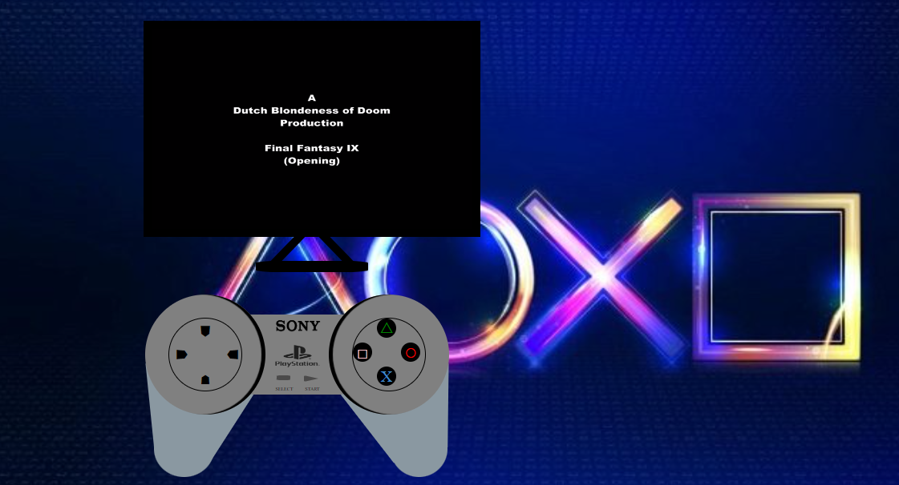

# Welcome to my frontend app

  
Proyecto consola 📝

  <ol>
    <li><a href="#objetivo-🎯">Objetivo</a></li>
    <li><a href="#sobre-el-proyecto-🔎">Sobre el proyecto</a></li>
    <li><a href="#deploy-🚀">Deploy</a></li>
    <li><a href="#stack">Stack</a></li>
    <li><a href="#vistas">Vistas</a></li>
    <li><a href="#futuras-funcionalidades">Futuras funcionalidades</a></li>
    <li><a href="#contribuciones">Contribuciones</a></li>
    <li><a href="#licencia">Licencia</a></li>
    <li><a href="#webgrafia">Webgrafia</a></li>
    <li><a href="#desarrollo">Desarrollo</a></li>
    <li><a href="#agradecimientos">Agradecimientos</a></li>
    <li><a href="#contacto">Contacto</a></li>
  </ol>

## Objetivo 🎯

Este proyecto requería un modelo de consola.

## Sobre el proyecto 🔎

Decidí crear una aplicación web basada en el diseño de un mando de ps1, que mostrara un video.

## Deploy 🚀

    <a href="https://github.com/ZackFer90/Prueba-git"><strong>Url a producción </strong></a>🚀🚀🚀

## Stack

<!--  -->

 

## Vistas

Resultado

Modelo

## Licencia

Este proyecto se encuentra bajo licencia de "Mi mismo"

## Webgrafia:

Para conseguir mi objetivo he recopilado información de:

- https://drive.google.com/file/d/1FFHcZEaBy4WhfLICcMD_Ih8t758nApkk/view
- https://drive.google.com/file/d/11AwoAdcGGJPWCwY3h_sqrYVhJGXZCRbC/view
- https://www.w3schools.com/cssref/css3_pr_transform.php

## Agradecimientos:

Agradezco a mis compañeros el tiempo dedicado a este proyecto:

- **Fidel**

- **Rodri**

- **Esteven**

- **Adriana**

- **Jose**

<!--
  

- **David**
  

- **_Mara_**
  
-->

## Contacto

